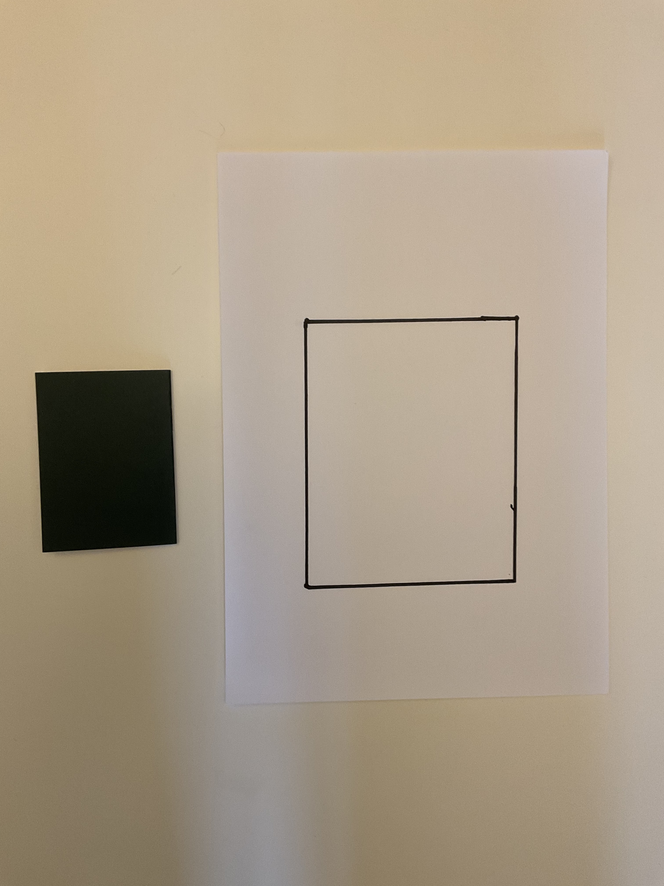
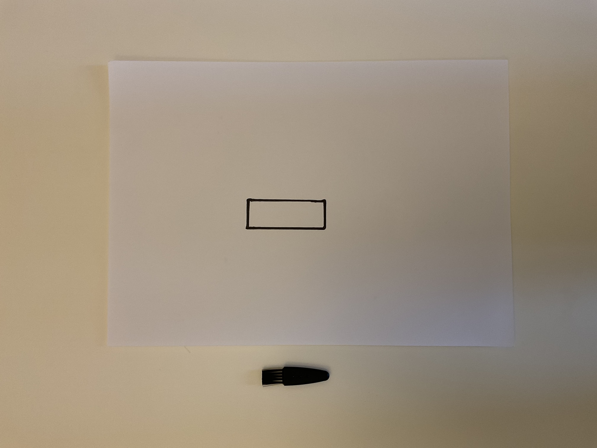
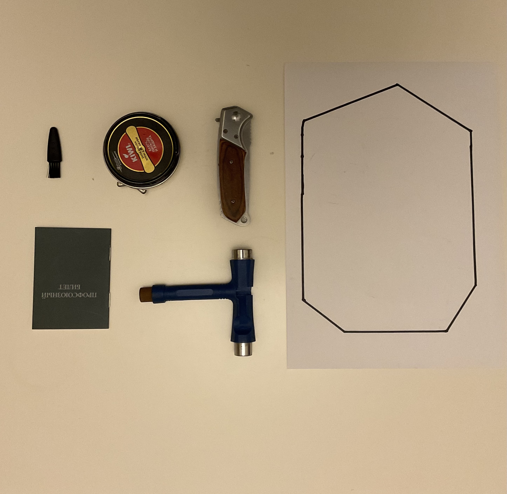
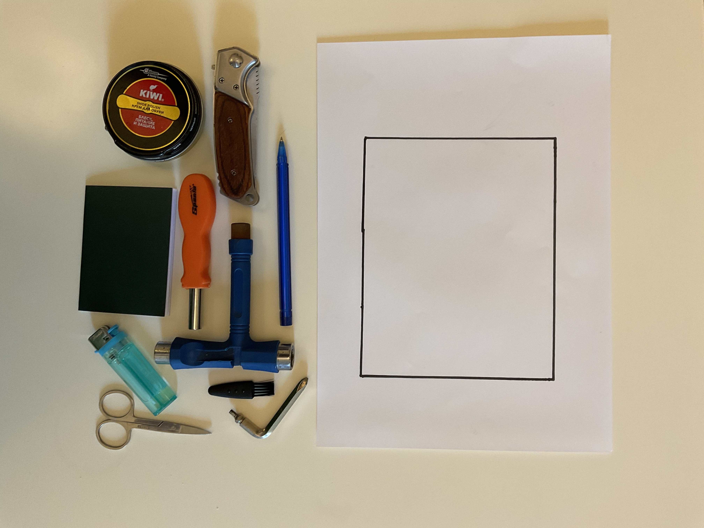

# Тестовые данные
Все тесты разбиты по папкам true и false, в зависимости от того, какой результат должна выдать программа. Всего 29 тестов.
## Описание наиболее репрезентативных тестов
0) Простая проверка на то, что 1 небольшой прямоугольный объект может поместиться в большой прямоугольник

Ответ: True

1) Проверка граничного случая. Маленький объект помещается в маленький многоугольник

Ответ: True

2) Маленький объект сложной формы не помещается в маленький прямоугольник

Ответ: False

3) Граничный случай: 2 объекта впритык помещаются в трапецию

Ответ: True

4) Проверка поведения при отсутствии объектов

Ответ: True

5) Проверка поведения при отсутствии многоугольника

Ответ: False

6) Проверка поведения при невыпуклом многоугольнике

Ответ: False

7) Проверка поведения при незамкнутом многоугольнике

Ответ: False

8) Объект сложной формы помещается в многоугольник

Ответ: True

9) Три объекта сложной формы впритык помещаются в многоугольник

Ответ: True

10) Три объекта не помещаются в многоугольник из-за особенностей формы одного из объектов

Ответ: False

11) Сложное размещение 2х объектов в трапеции

Ответ: True

12) Все предметы помещаются в большой многоугольник. Проверяется умение компоновать множество всех объектов

Ответ: True

13) Все предметы не помещаются в многоугольник

Ответ: False
