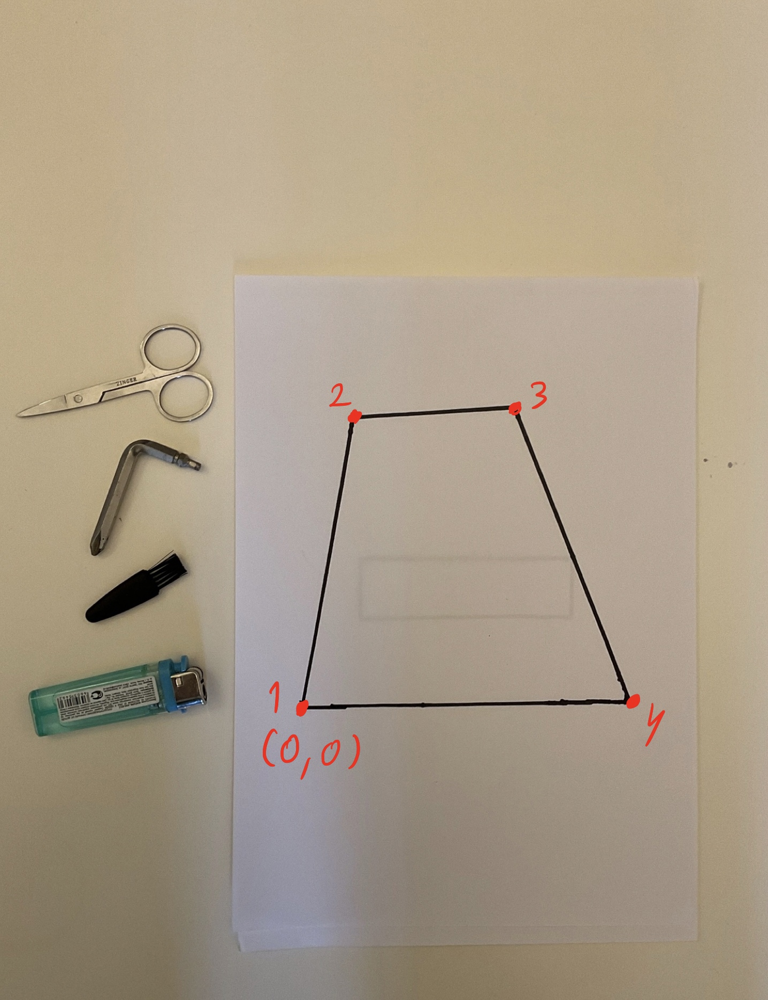
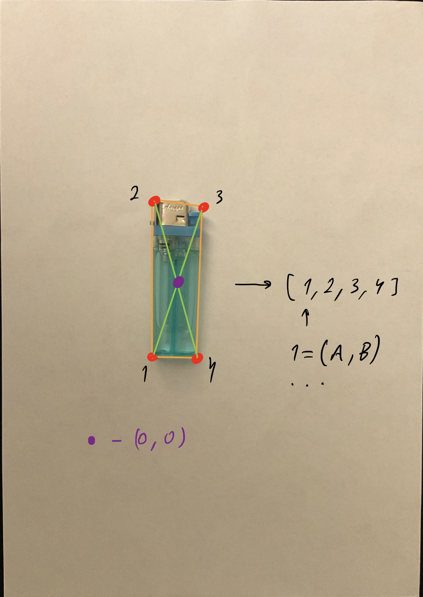

# План решения задачи
## Этапы работы алгоритма
### 1. Обработка изображения
* Сначала находим размер изображения в пикселях (можно узнать из мета информации об изображении). Далее подразумеваем, что 1 пиксель изображения - это квадрат размера 1 на 1 в наших координатах.
* Находим на изображении многоугольник. Многоугольник начерчен черной линией на белой бумаге, соответсвенно, градиент на границах мноугольника будет намного больше, чем на границах объектов. Введем **параметр порогового градиента**, после которого, мы сможем точно сказать, что данный объект заданный мноугольник.
* Далее делим изображение условными линиями на часть с мноугольником и без.
* Рассматриваем эти части по отдельности:
#### Работа с многоугольником 
* У многоугольника уже хорошо выделены границы, поэтому нам не нужно их как-то специально выделять еще раз.
* Находим особые точки мноугольника - углы методом Харриса, соответственно, здесь нужно ввести **параметр порогового значения** $R' (R > R'$ - угол, $R < R'$ - не угол$)$ и k = (0.04 - 0.06) для 
$R = det(M) - k(trace(M))^2$. 
* С помощью особых точек проверяем, является ли мноугольник выпуклым и мноугольник ли это, если какое-то из условий нарушается, то возвращаем False, Иначе идем дальше:
* Записываем особые точки многоугольника в упорядоченный массив, за первую точку будем всегда брать левый нижний угол многоугольника, и далее идти по точкам по часовой стрелке, записывая в массив. 

На выходе имеем массив точек, первая точка с координатой (0, 0). По данному массиву точек можно легко восстановить многоугольник. Длина 1 в координатах сооветствует 1му пикселю на изображении. 
#### Работа с объектами 
* Выделение границ (применяем детектор  Canny). На этом этапе добавляются еще **4 параметра: $\sigma$ для фильтра Гаусса, Нижний и верхний пороги, $\sigma$ для Canny.**
* Находим компоненты связности.
* Если не было найдено ни одной компоненты связности, то возвращаем True, иначе продолжаем:
* Обрабатываем компоненты связности - находим особые точки детектором Харриса. Делаем отображение каждой компоненты связности в объект - массив особых точек для этой компоненты (массив упорядоченный, должна быть возможность восстановить исходные очертания объекта, если дойти от первой до последней точки массива). Точки записанные в массив - координаты x', y'. Точка 0 для этих координат - центр данного объекта. Центр можно найти с помощью Distance transform, например.

Длина 1 в координатах будет сооветствовать 1му пикселю на изображении.
* Итак, на выходе после обработки объектов изображения мы получаем массив объектов - компонент связности, которые записаны с помощью координат углов.

### 2. Компоновка объектов в многоугольнике
После обработки изображения мы имеем многоугольник в виде массива с исходной точкой (0, 0) в его левом нижнем углу и объекты также записанные в виде массива, но в относительных координатах. Наша задача поместить эти объекты в многоугольник, для этого:
1. Берем самый большой объект из неразмещенных и пробуем приставить его к границе многоугольника, углом к углу, вплотную, для этого объект придется покрутить, оторбразив точки-вектора, которые его задают матрицей поворота, подкручивать надо на угол между одной из границ объекта и текущей рассматриваемой границей многоугольника. Если объект не удается присоединить ни к одной из границ (его точки пересекают границы, из линейной алгебры легко подобрать функцию для проверки), ***то пробуем поместить объект сопоставив центр многоугольника с центром объекта***, если и так не получается, то возвращем False. 
2. После размещения объекта изменяем многоугольник добавляя в него новые углы - особые точки объекта, которые лежат внутри многоугольника (не лежат на границах), точки  отрезанные новыми добавленными сторонами удаляем.

Повторяем 1й и 2й пункт до тех пор, пока объекты не закончились, либо пока программа не вернет False. Если объекты закончились, то возвращаем True.

***В случае, когда фигура добавляется в центр, задача сильно усложняется, поэтому данный кейс будет рассматриваться в возможных улучшениях.***

### Возможные улучшения
***В данном параграфе описаны улучшения, которые необходимо реализовать, в случае если данный алгоритм не сможет показать хороший результат на тренировочном датасете (хотя бы 90 % правильности).***
* Ввести в обработку кейс с сопоставлением центра многоугольника и центра объекта, в этом случае измененный многоугольник будет задаваться не одним массивом точек, а несколькими. Все массивы после первого будут задавать разрывы в многоугольнике и при размещении объекта надо будет проверять не пересекается ли он с этими разрывами.
* Добавить перебор объектов (начинать не с самого большого, следующий объект брать случайно и тп), во время работы алгоритм будет перебирать много вариантов - порядков, в которых объекты будут размещаться. Нужно будет добавить новый **параметр - количество таких переборов**.