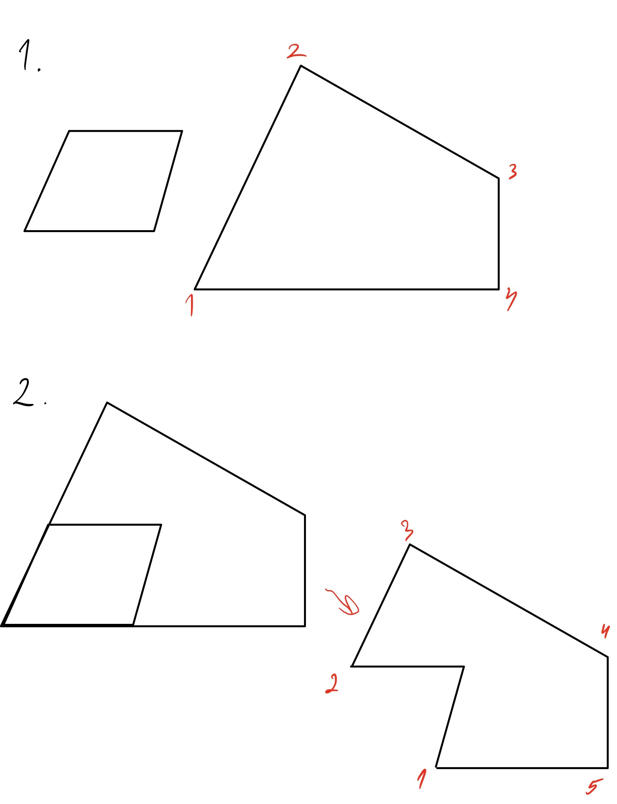

# План решения задачи
### 0. Предварительная подготовка
* Поскольку объекты на изображении могут быть из фиксированного множества, логично заранее посчитать их размеры в милимметрах и сохранить для каждого объекта упорядоченный массив точек-вершин. Далее по тексту это сохраненное множество будем называть базой примитивов.
* Помимо этого, программа заранее знает размеры листа A4, с помощью этих размеров легко будет посчитать абсолютный размер многоугольника с помощью размера относительно листа.

## Этапы работы алгоритма
### 1. Обработка изображения
* Находим на изобрании лист бумаги. Поскольку лист белый, он имеет самые яркие значения rgb, нужно будет поиграться с пороговыми значениями, благодаря которым мы сможем считать, что перед нами лист.
* Далее рассматриваем часть изображения с листом отдельно (на ней происходит работа с многоугольником), на оставшейся части изображения будет происходить работа с объектами.

#### Работа с многоугольником 
* Находим на листе особые точки мноугольника - углы методом Харриса, соответственно, здесь нужно ввести **параметр порогового значения** $R' (R > R'$ - угол, $R < R'$ - не угол$)$ и k = (0.04 - 0.06) для 
$R = det(M) - k(trace(M))^2$. 
* С помощью особых точек (если их нет, вернем False), проверяем, является ли мноугольник выпуклым, и мноугольник ли это, если какое-то из условий нарушается, то возвращаем False, Иначе идем дальше:
* Считаем размеры многоугольника, относительно листа A4. Поскольку мы знаем размер листа, мы сможем записать размеры многоугольника в мм, записав упорядоченный массив точек - координат его углов, начиная от левого нижнего угла.

#### Работа с объектами 
* Выделение границ (применяем детектор  Canny). На этом этапе добавляются еще **4 параметра: $\sigma$ для фильтра Гаусса, Нижний и верхний пороги, $\sigma$ для Canny.**
* Находим маски объектов с помощью карты границ, полученной детектором Canny.
* Если маски были найдены, пытаемся сопоставить объекты с объектами из нашей базы примитивов. Если маски не найдены, возвращаем True (это значит, что на изображении нет объектов).
* В итоге, получаем набор предметов с уже посчитанными размерами и координатами углов.

### 2. Компоновка объектов в многоугольнике
Наша задача поместить объекты в многоугольник, для этого:
1. Берем самый большой объект из неразмещенных и пробуем приставить его к границе многоугольника, углом к углу, вплотную, для этого объект придется покрутить, оторбразив точки-вектора, которые его задают матрицей поворота, подкручивать надо на угол между одной из границ объекта и текущей рассматриваемой границей многоугольника. Если объект не удается присоединить ни к одной из границ (его точки пересекают границы, из линейной алгебры легко подобрать функцию для проверки), ***то пробуем разместить объект не в углу, а в другой части многоугольника***, если и так не получается, то возвращем False. 
2. После размещения объекта изменяем многоугольник добавляя в него новые углы - особые точки объекта, которые лежат внутри многоугольника (не лежат на границах), точки  отрезанные новыми добавленными сторонами удаляем.

Повторяем 1й и 2й пункт до тех пор, пока объекты не закончились, либо пока программа не вернет False. Если объекты закончились, то возвращаем True.

***В случае, когда фигура добавляется не в угол, задача сильно усложняется, поэтому данный кейс будет рассматриваться в возможных улучшениях.***

### Возможные улучшения
***В данном параграфе описаны улучшения, которые необходимо реализовать, в случае если данный алгоритм не сможет показать хороший результат на тренировочном датасете (хотя бы 90 % правильности).***
* Ввести в обработку кейс с размещением объекта не в углу. Будем пытаться размещать объект сначала вдоль ребер, а потом ближе к центру многоугольника. В этом случае измененный многоугольник (он изменится, если объект получится разместить) будет задаваться не одним массивом точек, а несколькими (это будут разные части оставшегося для заполнения пространства). Соответственно, при размещении предметов надо будет по очереди проверять, поместится ли он в какую-то часть и размещать его в одной из частей (например, в самой маленькой). Также данное улучшение позволит обработать кейс с отрезанием куска многоугольника длинным предметом, например, ручкой.
* Добавить перебор объектов (пробовать начинать не только с самого большого, т. е. сначала попробовать от большего к меньшему, потом, если не выйдет, от меньшего к большему, потом брать объекты случайно), во время работы алгоритм будет перебирать много вариантов - порядков, в которых объекты будут размещаться. Нужно будет добавить новый **параметр - количество таких переборов**.